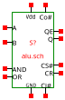

discus
======

Discus is an 8-bit CPU built from discrete transistors.  Currently it runs
in simulation, [integrated into a system with RAM and ROM](univlight.md).

It is a pure 8-bit Harvard architecture, with 8-bit code and data addresses, and
a four entry stack.  There are four general purpose registers, one of which is
the accumulator.  It uses a 2.5 stage RISC pipeline (opcode fetch/branch,
instruction execute, and writeback).  There is an integrated dynamic RAM
controller.  The CPU totals 1361 transistors.  Without the pipelining and DRAM
refresh the count would be more like 1000.

The instruction set is minimalist but functional.  All instructions are a single
byte and execution is strict single cycle throughput.  Constant values and some
memory accesses are implemented via prefix instructions.  The prefixes are
separate instructions, but leave their result in a “hidden” register that is
implicitly accessed by the following instruction.

Instructions with two operands have the accumulator as one operand and the
destination.  Single operand instructions (`INC`, `DEC`, `MOV`, `LOADM`) can use
any registers as their source and destination.

The instruction set is RISC style load/store.  Arithmetic instructions are
register-to-register.  Memory reads are either `LOADM` (to a named register), or
`MEM` (prefix loading to hidden register).  `STA` is the only memory write
instruction.

Branch (jump, call, return) instructions are executed in the first pipeline
stage.  All branches may be conditional. There are no indirect branches, and no
data access to the stack—it is not possible to branch to a computed address.

An earlier version of the instruction set is implemented in [verilog](verilog)
and ran 64-bit Miller-Rabin primality testing on an FPGA.  This application
drives some of the design decisions.  For example, using the hidden register `K`
for prefixes rather than a general purpose register, is because if the register
pressure in that code.

Circuitry Overview
------------------

The bulk of the implementation is in NMOS logic, with N-channel MOSFET switches
and 2.49kΩ load resistors, giving a 1mA current per logic gate at 2.5V.  BJTs
are used in the register files, both as pass gates, and as low-capacitance
interfaces to the sense lines.  A few gates use 820Ω load resistors, giving
faster response on higher-fan out lines critical for performance.

[SRAM cells](sramcell.md) are a mix of [4T2R](sramcell.md), [5T3R](sramcell2.md)
and [7T3R](sramcell2s.md) depending on the number of ports and drive strength.
Each SRAM cell has NMOS or CMOS cross-coupled inverters, and uses BJT pass gates
for the read and write ports.

Outside of the register files, [flip-flops](dflipflop.md) consist of a
[6T3R NMOS latch](dilatch.md) followed by a [SRAM cell](sramcellw.md).  There
are minor variants such as using a [5T3R NMOS latch](diplatch.md) when it is
safe for spurious pull-downs on the input.

Arbitrary AOI gates are used as needed, where sensible these are drawn in the
circuit diagram by connecting the outputs of open-drain gates together, although
there are a couple of discrete monsters in
[instruction decode](decode.md).  Significant use is made of stacked
gates, where the output of one gate is used as the ground connection of other
gates, essentially forming a wired-or.

Lines needing high fanout or high drive strength—mostly the bus and clock
lines—are driven by CMOS outputs.  PMOS logic is also used, mostly for 1-of-N
decoder trees.

The overall layout is bit-sliced, with the per-bit circuitry laid out on
[eight identical boards](bit.md) (139 transistors each), and a
[separate control board](control.md) (249 transistors).

The [bit slice board](bit.md) has the program counter, stack and branch
logic on the left, and the instruction execute pipe line stage on the right.
The [control board](bit.md) contains the status flags and register strobe
handling, with the [stack pointer](sp.md) and
[instruction decode](decode.md) in sub-circuits.

Bit slicing does cost some transistors, as some parts of the bit slice are not
need in each bit position.  For example the DRAM refresh controller is 8-bits
wide but only needs to be 6-bits wide, while the lowest bit of the program
counter could be simplified.

Registers
=========

The general purpose registers are `A`, `X`, `Y`, `U`.  `A` is the accumulator,
an implicit operand and destination of two argument instructions.  Otherwise,
all GP registers are interchangeable.

The hidden register is `K`.  This is written by prefix instructions (constants
or MEM prefix).  The instruction after a prefix, uses `K` as the source
register, instead of the register encoded in the instruction.

There are two condition flags, `C` and `Z`, stored as flip-flops in the
[control board](control.md).

There is an 8-bit program counter, and two bit [stack pointer](sp.md).
The four entry stack is implemented as a register file in the CPU, 128
transisters for storing 4 bytes, plus 38 for interfacing to the register file.

The DRAM refresh control contains an 8-bit counter.

Instruction Set & Encoding
==========================

### Source Register (`......RR`)

The last two bits of (nearly all) instructions identify a source register.
Values of RR are:

* **00** : `A`
* **01** : `X`
* **10** : `Y`
* **11** : `U`
* But `K` if the preceding instruction was a prefix.

The `CONST`, `MEM` and `IN` prefix instructions write the `K` register, and then
the decode of the subsequent instruction is overriden to read `K` instead of
using the instruction bits.

### Destination Register (`11DD..RR`)

Instructions with an explicit destination register put the register number in
bits 4 and 5.  The encoding is the same as the source register.

### Condition Codes (`...CCC..`)

Branch instructions put the condition in bits 2, 3, 4.  The encoding is:

* **000** : Always
* **001** : Never
* **010** : Always
* **011** : Never
* **100** : If Z
* **101** : If not Z
* **110** : If C
* **111** : If not C

### `CONST` prefix : `00nnnnnn`

This instruction writes K with an 8-bit constant.  The lower 6 bits are taken
from the opcode, while the high two bits are “stolen” from bits 0 and 1 of the
following instruction.  Because of the pipelining, those bits are available when
CONST executes.

The CONST instruction is never written explicitly in assembly
code—instead, it is generated automatically when a numeric constant
operand is used.

### `JUMP`, `CALL` : `00LCCCnn`

These share the opcode encoding of the `CONST` instruction.  They are
distinguished by disallowing two successive `CONST` instructions.  Instead,
immediately following a `CONST` instruction, a jump is decoded in preference,
with the `CONST` providing the target address for the jump.  The L bit is 0 for
a `JUMP` and 1 for a `CALL`.

All branches have a condition code; see above for the enumeration of the CCC
values.

The target address is given by the `CONST` prefix (6 bits from the `CONST` and 2
bits from the jump or call.  Note that the circuitry can't use the `K` register
though—the branch instruction happens in the wrong pipeline stage.  Instead,
when the branch is handled, the prefix can be found in the register holding the
instruction for the execute pipeline stage.

### `OUT` : `01000000`

`OUT` instruction.  This does nothing, but pulses a strobe.  External
peripherals may use the values from the accumulator bus.

Only the first four bits are decoded; any instruction starting 0100 is decoded
as `OUT`.

### `STA` : `010100rr`

Store the acumulator to memory.  The operand is the memory address to write.
Like the `OUT` instruction, the only circuitry within the CPU for `STA` is to
assert appropriate control strobes—the address and data buses are always driven.

Note that only the first four bits are decoded; any instruction starting 0101 is
decoded as `STA`.

### RET : `011CCC..`

Pops the PC from the stack, if the condition passes.  The operand is ignored.

Note that return-never instructions are overloaded.

This opcode is processed in the first stage of the pipeline, but uses the
condition flags set in the second stage.  This means that the condition flag for
the return is evaluated before an update by the immediately preceding
instruction, a hazard to be aware of.

(`JUMP` and `CALL` have the same quirk, but for those instructions, there is no
impact—for `JUMP` & `CALL`, the preceding instruction must be `CONST`
which does not change the condition flags.)

### `CMP` : `011001rr`

Subtract the operand from `A`, discarding the result, but updating `Z` and `C`
flags.  Subtraction `A − B` is implemented as `A + not B + 1`, which determines
the polarity of the `C` flag for `CMP` and subtract instructions.

This takes an instruction encoding otherwise assigned to “return never”.

### `TST` : `011011rr`

Compute the logical and of `A`, discarding the result, but updating `Z` and
setting `C` to 1.

This takes an instruction encoding otherwise assigned to “return never”.

### Arithmetic : `100aaarr`

Perform an arithmetic operation on the accumulator and operand, writing the
result to the accumlator and updating the `Z` and `C` flags.

The encoding of `aaa` is:
* **000** : `ADD` (add without carry)
* **001** : `SUB` (subtract without carry)
* **010** : `OR ` (sets `C` to 0 also)
* **011** : `AND` (sets `C` to 1 also)
* **100** : `ADC` (add with carry)
* **101** : `SBC` (subtract with carry)
* **110** : `XOR` (sets `C` to 0 also)
* **111** : unused alias of `AND`.

Incidentally, the corresponding bits in `CMP` and `TST` instructions match `SUB`
and `AND` respectively, simplifying the instruction decode.

`ADD(A)` and `ADC(A)` instructions give left shift and (9-bit) rotate.  There
are no right shift instructions.

### `MEM` prefix : `101011rr`

Load the `K` register from memory.  The operand is the memory address.

Not all bits are decoded; there are aliases.

The `MEM` prefix is typically not written explicitly in assembly code.  Instead,
the letter 'M' is suffixed to the following instruction, e.g., `ADDM` instead of
`MEM`,`ADD`.

Note that with a `MEM` prefix, the operand bits of the following instruction are
ignored.

### `IN` prefix : `10100000`

Load `K` from the external result bus `Q` (the bus is open-drain).  The
accumulator bus may be used by external circuitry, and the `IN` strobe line is
asserted.

Not all bits are decoded; there are aliases.

### `INC` : `11dd00rr`

Write the operand plus one into the destination, and update `Z`.  The `C` flag
is not changed.

### `DEC` : `11dd01rr`

Write the operand minus one into the destination, and update `Z`.  The `C` flags
is not changed.

### `MOV` : `11dd10rr`

Write the operand into the destination.  No condition flag updates.

### `LOADM` : `11dd11rr`

Load the destination register from memory.  The operand is the memory address.

This is a convenience, `MEM`,`MOV` would achieve the same result, but taking two
bytes.

Processor Buses
===============

There are several buses:
* **`A`** : Accumulator bus.  This is a differential CMOS bus outputing the
  accumulator value for `STA` and `OUT` instructions.
* **`B`** : Operand bus.  This is a differential CMOS bus outputing a 
  memory address.  For instructions accessing memory, this is the instruction
  operand.  For instructions not accessing memory, the DRAM refresh address
  is output.
* **`Q`** : Result bus.  This is an open drain bus carrying the result of the
  current instruction.  It is driven by memory reads and IN instructions,
  in addition to all internal instruction result values.
* **`P`** : Program counter.  This is a differential CMOS bus outputing the PC
  for the code memory read.
* **`O`** : Opcode bus.  Open drain bus inputing the fetched opcode from
  the code memory read.

Internally, there is also the I bus, carrying the instruction currently in
execute.  The J and K buses are looped to lines on the O and I buses to give
respectively the jump target and `CONST` value.

Arithmetic Unit
===============

The arithmetic unit is essentially a ripple-carry adder, with an optional
inverter on one operand.  The two inputs are `A` and `B`.  The `A` input is
usually the accumulator.  The `B` input is the operand register encoded in the
instruction, and has an optional inverter.

Logical operations are implemented by disabling appropriate parts of the adder
and carry chain.  E.g.,
* The `XOR` instruction forces the carry chain to zero.
* The `A xor B` needed for a half-adder is equal to `(A or B) and not (A and
  B)`.  Disabling the `and` leaves an `OR`.
* Likewise, disabling the `or` in the `xor` leaves a `nand`, which can be
  inverted by forcing the carry chain to 1, giving an `AND` instruction.

This is visible in logic operations setting the carry flag to fixed values, so
that `AND(A)` and `OR(A)` can be used as carry-set and carry-clear instructions.

Increment and decrement instructions are implemented by forcing the `A` input to
be all-zeros or all-ones, and forcing the carry chain input oppositely.

The per-bit transistor count is 20 transistors per bit, including the
output-enable driving the `Q` bus.  Decoding the instruction to produce the
control stobes for the ALU takes 41 transistors.

The ripple carry uses two gate levels per bit.  This is on the critical path for
the CPU clock cycle time, and accounts for over half of it.  One gate level per
bit could be achieved by dualizing every second ALU bit, saving a transistor and
improving performance.  Pragmatically, keeping each bit identical is preferable.

Register File
=============

The main register file consists of the four architectural registers `A`, `X`,
`Y`, `U` and the hidden register `K`.  The register file is dual ported, with
separate read and write ports.

The accumulator `A` also outputs directly to a bus.  Four of the registers are
[5T2R NMOS SRAM cells](sramcell2.md), while the accumulator is a
[7T2R CMOS SRAM cell](sramcell2s.md), to give high drive strength for the
`A` bus.

The read port provides only weak access from the bit-line to the SRAM cell, so
that precharge is not necessary.  Writes are latched in a separate latch during
the execute stage, and written back to the register file in the first half of
the following clock cycle; hence the nominal 2.5 stage pipeline.

The write-back occurs simultaneously with decode logic of the execute stage of
the following instruction.  This keeps the write-back off the critical path for
the cycle time—the write-back is complete by the time the read strobes for the
next instruction have settled.

Program Counter and Stack
=========================

There is a [D flip-flop](dflipflop.md) per bit for the program counter,
and a ripple-carry chain for incrementing it, followed by muxes to integrate
with the stack and implement branch instructions.  Like the accumulator, the PC
has CMOS outputs, as it directly drives the address bus for instruction fetch.

The carry-chain is two gate-levels per bit, like the ALU carry-chain.  Due to
the simpler surrounding logic, it is well away from the critical-path: dualizing
alternating bits would save a transistor per bit, but make no difference to
performance.

The program counter is closely coupled to the stack.  This is an integrated
four-entry stack, with a Gray-coded stack pointer.  There is no access to the
stack or stack-pointer other than via `CALL`/`RET` instructions.

The stack storage is implemented as a four byte register file, using
[single ported 4T2R SRAM cells](sramcell.md).

Precharging the bit-lines is necessary, which is achieved by only accessing the
stack on the second half of each clock cycle.  The output path from the stack
into the PC is short, so this is not critical for the clock cycle time.

Note that the stack address strobes need to be stable during the second half of
the clock cycle (while the stack register file is accessed), so the opcode fetch
and decode of branch instructions must be complete in the first half of the
clock cycle.

At first sight, it appears to be an exhorbitent expenditure of transistors in
the CPU core to integrate the stack.  However, the
[SRAM cells](sramcell.md) for this only total 16 transistors on each
bit-slice, competitive with the transistor count of muxing stack operations onto
the data memory bus and the consequent coordination overheads.

Reset
=====

The opcode bus is open-drain.  Reset is implemented by pulling down the opcode
bus, giving continuous 00000000 instructions.

Normally this would alternate `CONST` prefix and `JUMP`-always instructions,
jumping to address 0, reseting the program counter.  To make sure the exit from
reset always leaves the instruction decode in the correct state, while in reset,
the decode is modified so that the jump to zero takes place on every clock
cycle.

The above takes no transistors to implement!  There is a 11 transistor flip-flop
synchronising with the clock, the combinatorial logic for reset is implemented
by using the flip-flop output as gated power to appropriate circuits.

Clocking
========

A two phase clock is used, generated from a single phase clock input.  The main
clock is ϕ, the main CPU flip-flops are positive edge triggered.  The main
register file combined with the preceeding latch again gives positive
edge-triggered behaviour.

The [clock drive](noverlap.md) is a CMOS flip-flop producing two out of
phase clocks, ϕ and ϕ1.  The flip-flop produces output duty cycles of slightly
less than 50%, with non-overlapping clock pulses: the falling edge of one clock
is before the rising edge the other.

The secondary clock ϕ1 is used for strobing writes to the stack and DRAM.  For
DRAM in particular, the non-overlapping clock phases are critical to correct
operation.

Main Memory
===========

As well as the CPU, there is memory… DRAM is implemented as
[arrays of 1T1R1C](drambyte.md) cells, consisting of a discrete capacitor and a
BJT pass gate.  A 64-byte DRAM board takes 512 transistors and 512 capacitors
for storage, plus 211 transistors for the decode, sense logic and I/O.  (There
are also 64 diodes).

The BJTs used are in fact heterojunction devices (HBT).  The device used are
designed for RF operation, however the critical parameters for us are the low
parasitic capacitance and the high reverse gain, rather than operation
frequency.

Typical DRAM uses differential bit-lines and sense circuitry.  Because of the
compromises of using BJT pass gates, we have to make do with single-ended
circuitry.

Precharging the bit-lines is necessary.  The precharge is implemented by
lowering the Vdd of the sense circuitry during the first half of the clock
cycle, and pulling up the bit-lines to that.  The lowered Vdd is approx 200mV
above the threshold of the sense transistors, a compromise to keep the sense
circuitry in a stable state.  The actual access happens in the second half of
the clock cycle.  Because memory reads always go directly into a register, the
reduced time available from the half clock cycle is not a concern.

[Program storage](rom64byte.md) is intended to be implemented as ROM, so there
is no DRAM refresh or precharge timing allowance on the program memory bus.
Opcode fetch is not critical path for performance.  While branches are executed
in the same clock cycle as opcode fetch, the logic for those is much simpler and
shorter than the main execution pipeline stage.
