# decode.sch schematic
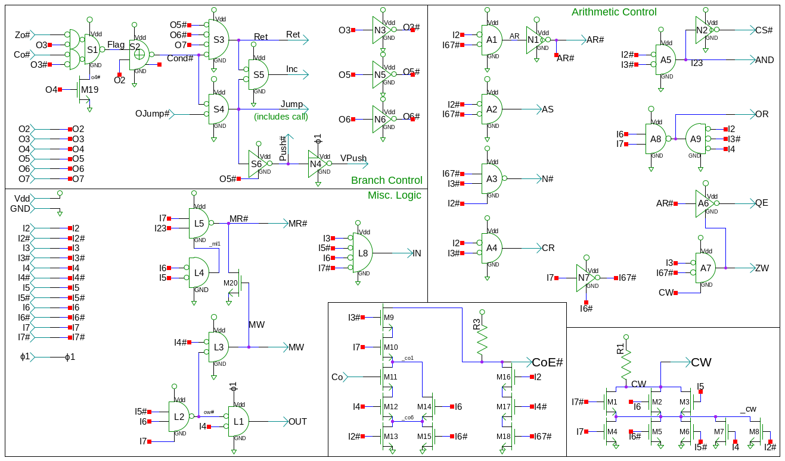
# Gates in decode.sch
[ 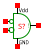 ](nors.html)

[ 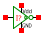 ](cnot.html)
[ 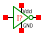 ](not.html)
[ 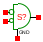 ](norod.html)
[ 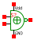 ](xnors.html)
[ 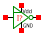 ](notp.html)
[ 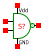 ](nands.html)
[ 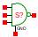 ](nand3od.html)
[ 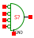 ](nor4od.html)

[ 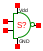 ](nand.html)
