# control.sch schematic
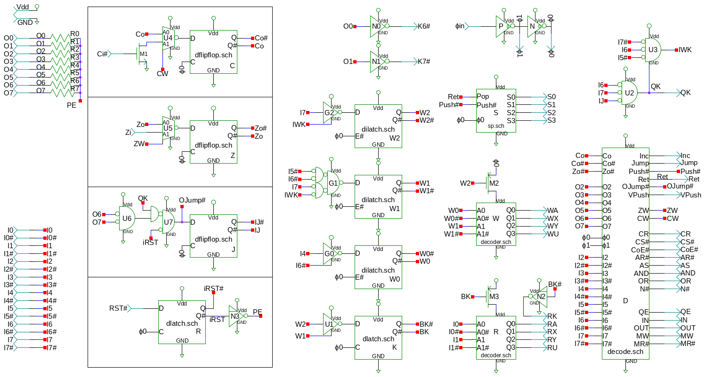
# Gates in control.sch
[ 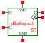 ](dflipflop.html)

[ 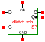 ](dlatch.html)
[ 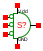 ](nor3.html)
[ 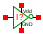 ](not.html)
[ 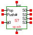 ](sp.html)
[ 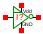 ](notp.html)
[ 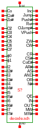 ](decode.html)
[ 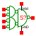 ](nandor.html)
[ 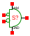 ](nor.html)
[ 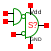 ](nor1and.html)
[ 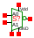 ](seli.html)
[ 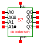 ](decoder.html)
[ 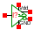 ](noverlap.html)
